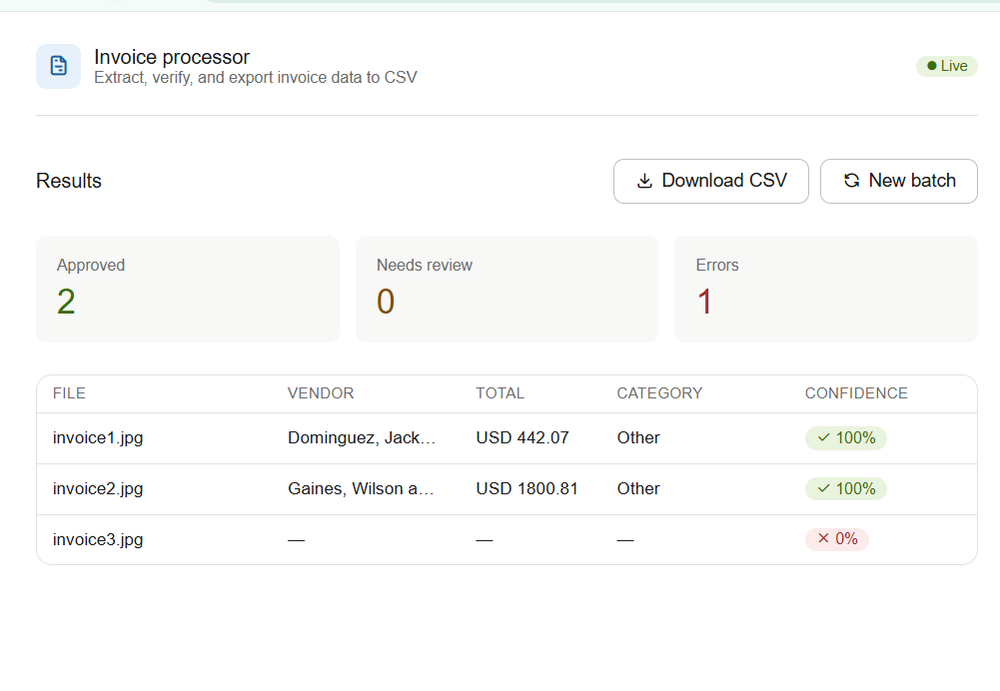

# Invoice Processor

[](https://your-app.railway.app)

AI-powered invoice data extraction and accounting export tool. Upload one invoice or a batch of 50+ — the system extracts structured data using Gemini Vision, scores each extraction by confidence, routes records automatically, and delivers a ready-to-import CSV in seconds.

Built for small businesses, bookkeepers, and accounting teams who process high volumes of invoices manually and want to automate the data entry step.

---

## What it does

- Extracts structured data from any invoice format: PDF, JPG, PNG, WEBP
- Pulls vendor name, invoice number, date, line items, subtotal, tax, total, IBAN, currency, and payment terms
- Classifies each invoice into an accounting category (Software & Subscriptions, Travel, Professional Services, Utilities, Meals & Entertainment, Office Supplies, Other)
- Scores every extraction by confidence using two signals: field completeness and arithmetic consistency (subtotal + tax = total)
- Routes records into three output tiers automatically — no manual sorting needed
- Handles concurrent batch processing (up to 50+ invoices at once)
- Deduplicates files by MD5 hash — the same file uploaded twice is only processed once
- Exports clean CSVs ready for import into QuickBooks, Xero, or any accounting software

---

## Output tiers

| File | Confidence | What it means |
|---|---|---|
| `invoices.csv` | ≥ 75% | High confidence — go straight to accounting |
| `invoices_review.csv` | 20–75% | Partial extraction — human checks before importing |
| `invoices_wrong.csv` | < 20% | Wrong file type — not an invoice |
| `invoices_errors.csv` | Failed | Pipeline error — filename and error message |

---

## Data flow

```
User uploads file(s) via browser UI
        │
        ▼
FastAPI receives upload (main.py)
        │
        ├─── Single file ──► POST /process
        │                         │
        │                         ▼
        │                   extractor.py
        │                   ┌─────────────────────────────┐
        │                   │ 1. Validate (extension, size)│
        │                   │ 2. Route by size + type:     │
        │                   │    ≤4MB image → inline_data  │
        │                   │    PDF / >4MB → File API     │
        │                   │ 3. Call Gemini Vision        │
        │                   │    (generator.py handles     │
        │                   │     retries + 429/503)       │
        │                   │ 4. Score confidence          │
        │                   │    - field completeness      │
        │                   │    - arithmetic check        │
        │                   └─────────────────────────────┘
        │                         │
        │                         ▼
        │                   InvoiceData (Pydantic)
        │                         │
        │                         ▼
        │                   JSON response to UI
        │
        └─── Batch files ──► POST /batch
                                  │
                                  ▼
                            job_id created (jobs.py → SQLite)
                            returned to UI immediately
                                  │
                                  ▼
                            processor.py (background task)
                            ┌─────────────────────────────┐
                            │ 1. Discover files in folder  │
                            │ 2. MD5 dedup — skip dupes    │
                            │ 3. ThreadPoolExecutor        │
                            │    (5 workers, free tier)    │
                            │ 4. extract_invoice() × N     │
                            │ 5. Collect via as_completed()│
                            │ 6. Route: success / error    │
                            │ 7. Save results to SQLite    │
                            │ 8. Update job status: done   │
                            └─────────────────────────────┘
                                  │
                            UI polls GET /status/{job_id}
                            every 2 seconds
                                  │
                                  ▼ status = done
                            GET /export/{job_id}
                                  │
                                  ▼
                            convertor.py
                            Splits results into 4 CSVs
                            by confidence tier
                                  │
                                  ▼
                            CSV download in browser
```

---

## Project structure

```
invoice-processor/
├── config.py          # Constants: model names, thresholds, formats, batch settings
├── model.py           # Pydantic schemas: InvoiceData + nested Item
├── generator.py       # Gemini client + call_gemini() with retry logic (429/503)
├── extractor.py       # Single-invoice pipeline: validate → prepare → extract → score
├── jobs.py            # SQLite job store: create, update, save, retrieve
├── processor.py       # Batch orchestration: dedup, ThreadPoolExecutor, routing
├── convertor.py       # InvoiceData list → 4 CSVs by confidence tier
├── main.py            # FastAPI app: endpoints + static file serving
├── static/
│   └── index.html     # Upload UI: drag & drop, progress polling, results table
├── .env               # API keys (never committed)
├── .gitignore
├── Dockerfile
├── docker-compose.yml
└── requirements.txt
```

---

## API endpoints

| Endpoint | Method | Input | Output |
|---|---|---|---|
| `/` | GET | — | Upload UI (index.html) |
| `/process` | POST | Single file (multipart) | InvoiceData as JSON |
| `/batch` | POST | Multiple files (multipart) | `{ job_id }` |
| `/status/{job_id}` | GET | job_id | `{ status: processing/done/failed }` |
| `/export/{job_id}` | GET | job_id | CSV file download |

---

## Confidence scoring

Every extracted invoice gets a confidence score between 0.0 and 1.0, computed in code — not self-reported by the AI.

**Signal 1 — Field completeness:**
Checks how many critical fields came back non-null.
Critical fields: `vendor_name`, `invoice_date`, `invoice_number`, `total_amount_due`, `currency`.
Score = filled critical fields ÷ total critical fields.

**Signal 2 — Arithmetic consistency:**
If `subtotal`, `tax_total`, and `total_amount_due` are all present:
checks `abs((subtotal + tax_total) - total_amount_due) ≤ 0.05`.
If the math fails, confidence is capped at 0.5 regardless of completeness —
a plausible-looking wrong number is more dangerous than a missing field.

---

## Gemini Vision integration

Two routing strategies depending on file characteristics:

**Inline data** — images ≤ 4MB:
```
file bytes → base64 → types.Blob → types.Part(inline_data=...)
```

**File API** — PDFs and files > 4MB:
```
upload to Gemini File API → URI valid 48h → types.Part(file_data=...)
→ always deleted in finally block
```

Retry logic on every Gemini call:
- `429 RESOURCE_EXHAUSTED` → parse `retry in Xs` from error → sleep X+3s → retry
- `503 UNAVAILABLE` → fixed 10s sleep → retry
- Max 3 attempts, then raises `RuntimeError`

---
## Try it with sample invoices

Don't have invoices at hand? Download these dummy samples:

- [Sample invoice 1 – Office supplies](https://github.com/yourusername/invoice-processor/raw/main/samples/invoice1.pdf)
- [Sample invoice 2 – Consulting services](https://github.com/yourusername/invoice-processor/raw/main/samples/invoice2.jpg)

Place them in the `samples/` folder or upload directly through the UI.
## Tech stack

| Layer | Technology |
|---|---|
| AI extraction | Google Gemini 2.5 Flash (Vision) |
| Schema validation | Pydantic v2 |
| API framework | FastAPI |
| Concurrency | ThreadPoolExecutor (5 workers) |
| Job tracking | SQLite |
| Containerization | Docker + Docker Compose |
| Deployment | Railway |
| Frontend | Vanilla HTML/CSS/JS (no framework) |

---

## Run locally

**1. Clone and set up environment:**
```bash
git clone https://github.com/yourusername/invoice-processor
cd invoice-processor
```

**2. Add your API key:**
```bash
# create .env file
echo "GEMINI_API_KEY=your_key_here" > .env
```

**3. Run with Docker:**
```bash
docker compose up --build
```

**4. Open the UI:**
```
http://localhost:8000
```

---

## Run without Docker

```bash
pip install -r requirements.txt
uvicorn main:app --reload
```

---

## Environment variables

| Variable | Description |
|---|---|
| `GEMINI_API_KEY` | Google AI Studio API key |

Get a free key at: https://aistudio.google.com

---

## Deployment (Railway)

1. Push repo to GitHub
2. Go to railway.app → New Project → Deploy from GitHub
3. Select this repo
4. Add `GEMINI_API_KEY` under Variables
5. Railway detects the Dockerfile and deploys automatically
6. Public URL is generated — share it directly with clients

---

## Use cases and pricing reference

| Deliverable | Scope | Price range |
|---|---|---|
| Single-client invoice processor | Setup + deployment | $400–600 |
| Custom category taxonomy | Add client's chart of accounts | $100–150 |
| Accounting software CSV format | Match QuickBooks/Xero column layout | $75–100 |
| Monthly maintenance retainer | Prompt tuning + monitoring | $75–150/month |

---

## Limitations

- Handwritten invoices may score lower confidence — recommend photo in good lighting
- Vector graphics inside PDFs (charts drawn as shapes) are not extracted as images
- Free tier: 15 requests/minute on Gemini 2.5 Flash. Large batches may queue.
- Uploaded files are ephemeral on Railway — flagged originals are not persisted after export
