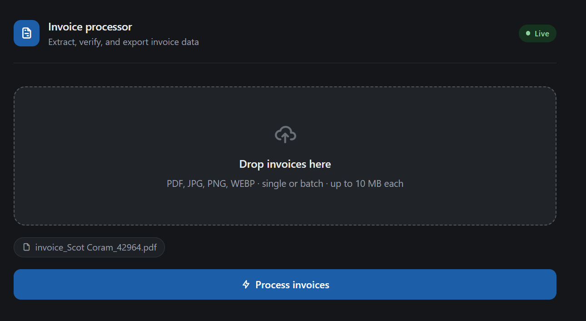
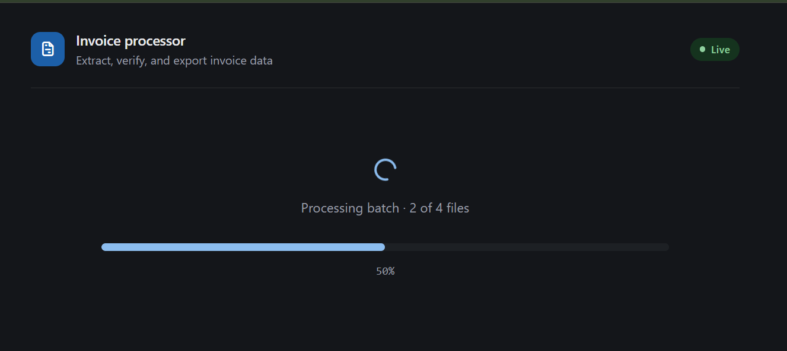
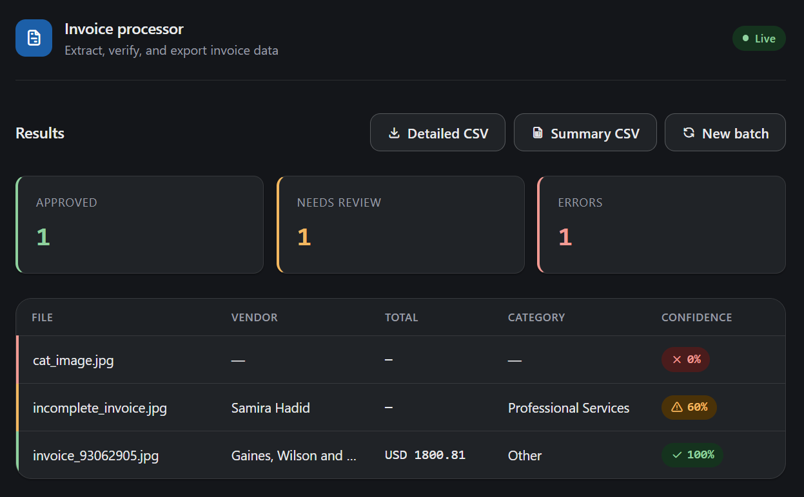
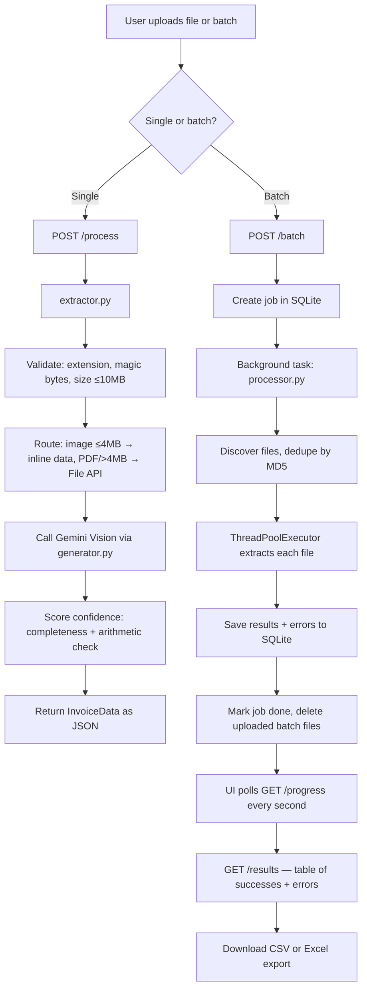

# Invoice Processor
## How it looks

**1. Drop in invoices**


**2. Watch the batch process**


**3. Review results, tiered by confidence**


[]([https://your-app.railway.app](https://invoiceprocessorchabot-production.up.railway.app/))


AI-powered invoice data extraction and accounting export tool. Drop in one invoice or a batch — the system extracts structured data with Gemini Vision, scores each extraction by confidence, and hands back ready-to-import CSV or Excel files in seconds.

Built as a portfolio MVP demonstrating an end-to-end document-processing pipeline: file validation, async batch processing with live progress, structured LLM extraction, and multi-format export.

---

## Contents

- [What it does](#what-it-does)
- [Exports — what each one contains](#exports--what-each-one-contains)
- [How it works](#how-it-works)
- [Project structure](#project-structure)
- [API endpoints](#api-endpoints)
- [Confidence scoring](#confidence-scoring)
- [Gemini Vision integration](#gemini-vision-integration)
- [Security & validation](#security--validation)
- [Tech stack](#tech-stack)
- [Testing](#testing)
- [Run locally](#run-locally)
- [Environment variables](#environment-variables)
- [Deployment (Railway)](#deployment-railway)
- [Design decisions & trade-offs](#design-decisions--trade-offs)
- [Limitations](#limitations)
- [Use cases and pricing reference](#use-cases-and-pricing-reference)

---

## What it does

- Extracts structured data from invoices in PDF, JPG, PNG, or WEBP format
- Pulls vendor name, invoice number, date, line items, subtotal, tax, total, IBAN, currency, and notes
- Classifies each invoice into an accounting category (Software & Subscriptions, Travel, Professional Services, Utilities, Meals & Entertainment, Office Supplies, Other)
- Scores every extraction with a 0.0–1.0 score computed in code from two signals — field completeness and arithmetic consistency (subtotal + tax ≈ total) — not self-reported by the model
- Handles batch processing with live progress (X of Y files), backed by a SQLite job store
- Deduplicates files within a batch by MD5 hash — identical files are processed only once
- Exports results as a detailed CSV (one row per line item), a summary CSV (one row per invoice), or a 3-sheet Excel workbook split by confidence tier

---

## Exports — what each one contains

| Export | Endpoint | Granularity | Notes |
|---|---|---|---|
| Detailed CSV | `/export/{job_id}` | One row per line item | All extracted invoices, regardless of confidence. Pipeline errors are **not** included in this file — see them in the live results table or the Excel export's "Erreurs" sheet. |
| Summary CSV | `/export/summary/{job_id}` | One row per invoice | Drops invoices with no `invoice_number`, `vendor_name`, or `total_amount_due` (treated as non-invoices). No line items. |
| Excel workbook | `/export/excel/{job_id}` | One row per invoice, 3 sheets | **Approuvé**: confidence ≥ `CONFIDENCE_THRESHOLD` (0.75). **À revoir**: below threshold. **Erreurs**: pipeline failures + invoices with no usable data. Header row is styled, columns auto-sized, and all cells are sanitized against formula injection. |

Only the Excel export tiers invoices by confidence — the CSV exports are flat dumps of everything that came back from the pipeline.

---

## How it works



Every Gemini call goes through `generator.py`, which retries on `429`/`503` with exponential backoff (5s, 10s, 20s, 40s, 60s, 60s) before giving up after 6 attempts.

---

## Project structure

```
invoice-processor/
├── config.py            # Constants: model names, thresholds, formats, batch settings
├── model.py              # Pydantic schemas: ExtractedInvoice (Gemini output) + InvoiceData (stored record)
├── generator.py          # Gemini client + call_gemini() with retry logic
├── extractor.py           # Single-invoice pipeline: validate → prepare → extract → score
├── jobs.py                 # SQLite job store (WAL mode): create, update, save, retrieve
├── processor.py             # Batch orchestration: dedup, ThreadPoolExecutor, cleanup, logging
├── convertor.py              # InvoiceData list → sanitized CSV exports
├── utils.py                   # Shared helpers (formula-injection sanitizer)
├── main.py                     # FastAPI app: endpoints + static file serving
├── static/
│   └── index.html                # Upload UI: drag & drop, progress polling, results table
├── test_extractor.py               # Unit tests for confidence scoring
├── test_convertor.py                # Unit tests for CSV flattening + sanitization
├── .env                               # API keys (never committed)
├── .env.example                        # Template for required env vars
├── .gitignore
├── Dockerfile
├── docker-compose.yml
├── requirements.txt
└── requirements-dev.txt                 # Adds pytest, for local testing only
```

---

## API endpoints

| Endpoint | Method | Input | Output |
|---|---|---|---|
| `/` | GET | — | Upload UI (`static/index.html`) |
| `/health` | GET | — | `{ status, model }` — used for container health checks |
| `/process` | POST | Single file (multipart) | `InvoiceData` as JSON |
| `/batch` | POST | Multiple files (multipart) | `{ job_id, message }` |
| `/status/{job_id}` | GET | job_id | `{ job_id, status }` |
| `/progress/{job_id}` | GET | job_id | `{ job_id, status, total, processed }` |
| `/results/{job_id}` | GET | job_id | `{ job_id, results, errors }` |
| `/export/{job_id}` | GET | job_id | Detailed CSV download |
| `/export/summary/{job_id}` | GET | job_id | Summary CSV download |
| `/export/excel/{job_id}` | GET | job_id | 3-sheet Excel download |

Rate limits: `10/minute` on `/process`, `5/minute` on `/batch`, keyed by client IP via `slowapi`, with Railway's proxy headers respected so the limit is per visitor rather than global.

---

## Confidence scoring

Every extracted invoice gets a score between 0.0 and 1.0, computed in code from two independent signals.

**Field completeness** — how many critical fields came back non-null, out of `vendor_name`, `invoice_date`, `invoice_number`, `total_amount_due`, `currency`.

**Arithmetic consistency** — if `subtotal`, `tax_total`, and `total_amount_due` are all present, checks `abs((subtotal + tax_total) - total_amount_due) ≤ 0.05`. If the math fails, confidence is capped at 0.5 regardless of completeness, since a plausible-looking wrong number is more dangerous to an accounting workflow than a missing field.

The threshold splitting "Approuvé" vs "À revoir" in the Excel export is `CONFIDENCE_THRESHOLD = 0.75` in `config.py`.

> [!NOTE]
> This score measures **completeness and internal consistency**, not true extraction accuracy — it can't catch a confidently wrong value in a field that looks well-formed (e.g. the wrong vendor name spelled correctly). A more rigorous version would run each extraction twice and flag fields where the two runs disagree, but that doubles Gemini calls per invoice, which isn't worth it against the free tier's 15 requests/minute. Worth knowing if you're deciding how much to trust the "Approuvé" tier for anything high-stakes.

---

## Gemini Vision integration

Two routing strategies depending on file characteristics:

**Inline data** — images ≤ 4MB:
```
file bytes → types.Blob → types.Part(inline_data=...)
```

**File API** — PDFs and files > 4MB:
```
client.files.upload(file=file_path) → poll every 2s (30s timeout) until ready
→ types.Part(file_data=...) → always deleted in finally block
```

Gemini's structured output is generated against `ExtractedInvoice` (a Pydantic schema with only the fields the model should fill in), not the full `InvoiceData` record — `filename` and `confidence` are computed in code afterward rather than asking the model to guess them.

---

## Security & validation

- **Magic-byte validation**: every upload is checked against known file signatures, not just its extension. WEBP specifically checks for the `WEBP` marker at bytes 8–11 inside the RIFF container, not just a bare `RIFF` prefix (which `.wav`/`.avi` files also share).
- **Filename sanitization**: uploaded filenames are stripped to their base name (`Path(name).name`) before being used in a file path, preventing path traversal.
- **Formula-injection protection**: any cell value starting with `=`, `+`, `-`, or `@` is prefixed with a leading quote before being written to CSV or Excel, so a malicious invoice field can't execute as a spreadsheet formula when the export is opened.
- **Fail-fast startup check**: the app refuses to start if `GEMINI_API_KEY` is missing, rather than silently hanging on the first request.
- **Per-IP rate limiting**: enforced with Railway's proxy headers respected, so the limit applies per visitor.

> [!WARNING]
> Job results have no per-user access control — anyone with a `job_id` can fetch that job's results. UUIDs aren't easily guessable, but don't upload sensitive real invoices to a public deployment of this demo.

---

## Tech stack

| Layer | Technology |
|---|---|
| AI extraction | Google Gemini 2.5 Flash (Vision), via the `google-genai` SDK |
| Schema validation | Pydantic v2 |
| API framework | FastAPI |
| Concurrency | `ThreadPoolExecutor`, `MAX_WORKERS` (default 1, configurable in `config.py`) |
| Job tracking | SQLite (WAL mode) |
| Spreadsheet export | openpyxl |
| Rate limiting | slowapi |
| Testing | pytest |
| Containerization | Docker + Docker Compose |
| Deployment | Railway |
| Frontend | Vanilla HTML/CSS/JS — no framework |

`MAX_WORKERS` defaults to 1 to stay comfortably under Gemini's free-tier rate limit (15 requests/minute). Raise it if you have a paid Gemini quota — just know that higher concurrency increases the chance of SQLite write contention on `jobs.db`, mitigated but not eliminated by WAL mode.

---

## Testing

```bash
pip install -r requirements-dev.txt
pytest -v
```

Covers confidence-score edge cases (zero subtotal, arithmetic mismatch, missing critical fields) and CSV flattening/sanitization (multi-item invoices, formula-injection payloads).

---

## Run locally

**1. Clone and set up environment:**
```bash
git clone https://github.com/yourusername/invoice-processor
cd invoice-processor
```

**2. Add your API key:**
```bash
cp .env.example .env
# then edit .env and set GEMINI_API_KEY=your_key_here
```

**3. Run with Docker:**
```bash
docker compose up --build
```

**4. Open the UI:**
```
http://localhost:8000
```

### Run without Docker

```bash
pip install -r requirements.txt
uvicorn main:app --reload
```

---

## Environment variables

| Variable | Description |
|---|---|
| `GEMINI_API_KEY` | Google AI Studio API key. The app fails fast at startup if this is missing. |

Get a free key at: https://aistudio.google.com

---

## Deployment (Railway)

1. Push repo to GitHub
2. Go to railway.app → New Project → Deploy from GitHub
3. Select this repo
4. Add `GEMINI_API_KEY` under Variables
5. Set the healthcheck path to `/health` in service settings
6. Railway detects the Dockerfile and deploys automatically
7. Public URL is generated — share it directly with clients

`docker-compose.yml` is for local development only — Railway builds and runs the `Dockerfile` directly and does not use Compose volumes.

---

## Design decisions & trade-offs

A few choices made deliberately, worth calling out rather than leaving implicit:

- **Confidence is computed in code, not self-reported by the LLM.** Asking a model to grade its own output is poorly calibrated in practice — scores cluster near 1.0 regardless of correctness. Deriving it from completeness + arithmetic consistency gives a weaker but verifiable signal instead.
- **`MAX_WORKERS = 1` by default**, trading batch speed for staying under the free Gemini tier's rate limit without needing manual throttling logic.
- **No per-user authentication or job ownership.** Acceptable for a single-operator portfolio demo; would need an access-token-per-job scheme (or real auth) before handling other people's data.
- **Errors are isolated per file, not per batch.** One corrupt or unsupported file in a batch of 50 doesn't fail the whole job — it's caught, logged, and routed to the "errors" bucket while the rest of the batch completes.

---

## Limitations

- Handwritten invoices may score lower confidence — recommend a clear photo in good lighting
- Vector graphics inside PDFs (charts drawn as shapes) are not extracted as images
- Free Gemini tier: 15 requests/minute. Large batches with `MAX_WORKERS = 1` will queue accordingly — a 30-invoice batch can take several minutes
- Storage is ephemeral: `jobs.db`, `uploads/`, and `outputs/` live on the container filesystem and are not persisted across deploys/restarts. Uploaded files for a batch are deleted automatically once that batch finishes processing
- No authentication — anyone with the URL can use the app (acceptable for a portfolio demo, not for production multi-tenant use)

---

## Use cases and pricing reference

| Deliverable | Scope | Price range |
|---|---|---|
| Single-client invoice processor | Setup + deployment | $400–600 |
| Custom category taxonomy | Add client's chart of accounts | $100–150 |
| Accounting software CSV format | Match QuickBooks/Xero column layout | $75–100 |
| Monthly maintenance retainer | Prompt tuning + monitoring | $75–150/month |
